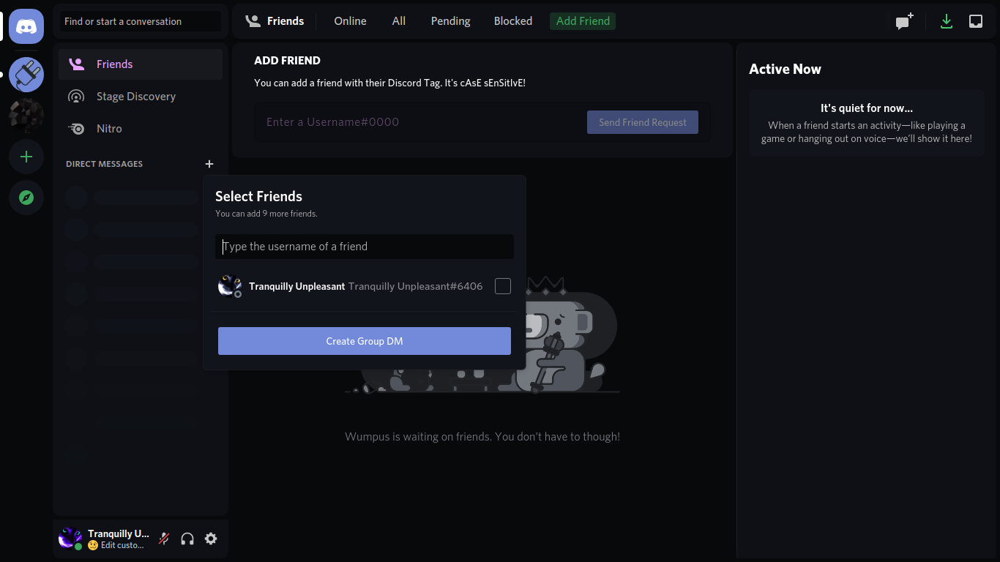

# midnightcord
a simple midnight theme for discord that's nice on your eyes.
it's somewhat based on the nocturnal betterdiscord theme with a few tweaks.

Orignial theme made by [spinfish](https://github.com/spinfish/midnightcord).

This repo is an older version with a fair amount of tweaks i made for personal use.

**This theme version is a very slow wip and very messy. Use at your own risk.**

## installation

Open a shell in your powercord themes folder.

For windows, go to the folder, press `ctrl + D` then type in `powershell`

For mac, first open `services` from finder and enable `New Terminal at Folder` if you havent already. Then go to the folder in finder, right click and open a terminal.

For linux, you know how to open a terminal.

Once you have a terminal open just type:
```shell
git clone https://github.com/tranquillyunpleasant/midnightcord
```

And then restart discord.
## license

MIT, see LICENSE.md for more details

## previews





